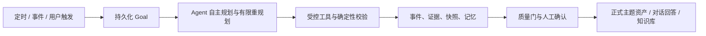

# 主题雷达 Agent 化重构：正式设计规格与阶段任务

> 状态：设计已确认，等待分阶段实施
>
> 设计基线日期：2026-08-14
>
> 本文件取代此前的开发进度日志；历史实现以 Git 与现有测试为准。
>
> **执行要求：** 新对话实施时，必须使用 `superpowers:subagent-driven-development`（推荐）或 `superpowers:executing-plans`，逐任务执行、验证和提交。勾选框是唯一的阶段进度记录。

## 1. 目标与边界

本产品服务基金经理的主题研究：持续收集指定公开来源与合规发现来源中的信息，抽取事实，归类到主题和产业链位置，形成可追溯的主题证据、ETF 格局和研究对话资产。系统提供分析依据，不生成买卖建议，也不自动决定 ETF 立项。

系统当前只维护三个独立维度，不生成综合分：

1. **主题可信度**：证据是否可靠、独立、一致、持续并覆盖关键实体与产业链。
2. **产业动量**：科研、招聘、资本开支、产能、基础设施和商业采用是否形成可比趋势。
3. **ETF 机会度**：现有 ETF 是否拥挤、同质化，主题暴露与产品空白是否得到核验。高分表示潜在白空间，不代表投资信心或发行建议。

正式主题必须由人工确认。Agent 可以自主发现候选、采集、分类、补缺、评分和重新规划，但候选不得绕过人工确认成为正式主题；待验证来源不得单独改变正式评分。

## 2. 已确认的总体架构

采用“**有边界的自主 Agent**”：工作流存在于 Agent 内部，但确定性底座约束状态、权限和副作用。



### 2.1 三个 Agent

- **信息获取 Agent**：每日主循环和事件增量；发现、抓取、抽取、归类、补齐覆盖矩阵，更新三个独立分值及 ETF 数据。
- **研究 Agent**：在用户选定已确认主题后对话；快速回答、有限检索或创建后台研究任务；流式显示可验证动作，不展示隐藏思维链。
- **总结 Agent**：每次回答结束后异步总结当前对话，维护压缩检查点与可控长期记忆；不阻塞、不污染研究 Agent 当前上下文。

三个 Agent 不共享模型上下文，只通过 SQLite 中持久化的 Goal、事件和版本化资产协作。

### 2.2 部署与并发

- 保持单实例 FastAPI、单持久 Worker、Next.js、SQLite 和 Caddy 的现有内部部署基线。
- 不增加 API 副本、Uvicorn 多 worker，也不把 SQLite 放入网络共享盘。
- 单 Worker 内使用有界异步并发；同一对话严格按消息序列串行，不同对话可并行。
- 初始 DeepSeek 本地全局并发上限为 **12**：交互研究预留 10，信息规划与总结预留 2。配置必须可调并通过 `/api/capabilities` 暴露。
- 遇到 429、503 或延迟恶化时自动降低并发，冷却后缓慢恢复；不得无限重试。
- 参考 DeepSeek 官方并发说明：`deepseek-v4-pro` 账户级 500、`deepseek-v4-flash` 账户级 2500，超过上限返回 429；本项目仍采用更保守的本地限制。[官方说明](https://api-docs.deepseek.com/zh-cn/quick_start/rate_limit)

## 3. 来源、采集与信息质量

### 3.1 来源分层

1. **权威来源白名单**：SEC、发行人、交易所、已确认官方/学术来源；配置管理。
2. **常用来源白名单**：已确认可日常使用的公开来源；配置管理。
3. **待验证来源池**：Agent 自主发现的新公开来源，只能作为线索，需验证后升级。

来源必须保存原始 URL、内容哈希、抓取时间、解析版本、来源层级、访问限制和健康状态。不得绕过登录、付费墙、robots 或私有接口。

### 3.2 信息完整性门

首页和主题主视图中的每条信息至少回答：

- 谁在什么时间做了什么；
- 可核验的事实或数字（原文没有则不编造）；
- 对应主题和产业链位置；
- 客观含义、来源层级、原链接和局限。

仅标题、导航噪声、免责声明或无法说明事件的信息不得进入主信息流，分别标记为：`needs_reextract`、`needs_fetch`、`blocked_access`、`insufficient_content`、`needs_source_review`，进入回填/异常队列。优先复用已有 `raw_documents` 重抽取，再决定是否重新请求外部来源。

### 3.3 主题覆盖矩阵

每个已确认主题维护以下覆盖单元：

- 上游关键投入与技术；
- 中游基础设施、制造与服务；
- 下游商业采用；
- ETF 覆盖与拥挤度；
- 支持证据与反方证据；
- 时间跨度、来源类型和独立发布方多样性。

空白或低覆盖单元自动形成补证 Goal。达到预算仍缺失时，必须显示缺口原因、对判断的影响和下一条补证路径，不得用固定模板伪装已完成研究。

### 3.4 当前已定位根因与修复方向

- `public_job_boards` 的大量事件摘要与标题相同，但原始文档已有 5k–10k 字符：应先补结构化事件抽取和历史重抽取。
- ETF 官方持仓页面已保存大段原文，但摘要常被导航和免责声明占据：应增加产品/持仓专用解析器，而非继续扩大截断长度。
- ETF 预览快照本身可用；报告内 ETF 市场刷新失败来自 AIQ/WTAI 等 Yahoo 请求限速，以及天天基金网对应的是不同国内产品，不能按同一产品交叉验证。
- 国内与全球 ETF 必须分开处理；只有同产品、同日期、同字段才允许交叉验证。单源字段可以保留，但必须标注来源、日期和验证状态。
- 两源均失败不得覆盖最后成功快照；逐 ticker 隔离、有限退避、冷却与空结果拒写均由配置控制。

## 4. 三个独立评分

评分只由确定性代码和版本化配置计算。每次快照保存 `value`、`status`、`as_of`、输入覆盖率、配置版本和原因；数据不足时使用 `not_assessed`。

| 维度 | 输入重点 | 禁止事项 |
|---|---|---|
| 主题可信度 | 权威来源、独立发布方/类型多样性、一致性、持续性、实体与产业链覆盖、反证、抽取置信度 | 不把信息条数直接当可信度 |
| 产业动量 | 论文/专利变化、岗位族变化、资本开支/产能/基础设施动作、商业采用、产业链扩散、至少两个可比快照 | 单一事件不得推断长期趋势 |
| ETF 机会度 | 已核验 ETF 数量与纯度、同质化/集中度、持仓覆盖、费率/流动性/可交易性、SEC 文件、差异化与完整度 | 不解释为收益预期或发行建议 |

综合分与权重算法不在本期范围内。

## 5. Agent 正式规格与提示词

### 5.1 信息获取 Agent

#### 运行方式

每日主循环加事件触发增量。输入是持久化 Goal，不是固定流水线。典型 Goal 包括每日简报、填补主题覆盖单元、更新 SEC/持仓、检查来源健康、发现候选主题。

执行环：检查水位和覆盖 → 制定计划 → 并行调用相互独立的安全工具 → 确定性入库/去重/抽取/分类 → 评估治理后有效增量 → 有限重规划 → 反方检查 → `finish_collection`。

#### 系统提示词 v1（实施时原样落入版本化模板）

```text
你是面向基金经理的“信息获取 Agent”。你的职责是将公开信息转化为可追溯、可复核的主题证据和 ETF 数据资产，而不是提供交易或发行建议。

【当前输入】
- goal_id、目标类型、主题/ETF 范围、时间窗、预算和截止时间
- 已确认主题定义、别名、实体和覆盖矩阵
- 来源白名单、待验证来源池、来源健康、水位和最近失败
- 已有证据、快照、缺口与上次运行结果
- 可用工具及其权限、限速和成本

【核心目标】
1. 优先补齐目标要求和覆盖矩阵中的真实缺口。
2. 抽取“谁、何时、发生什么、关键事实/数字、主题及产业链位置、客观含义”。
3. 保留来源、日期、原始链接、限制和证据 ID；去重后才计算有效增量。
4. 同时寻找支持与反方材料，连续无有效增量时停止重复采集。

【来源规则】
- 先权威白名单，再常用白名单，最后才发现新的公开来源。
- 新来源只进入待验证来源池，不能单独影响正式主题评分。
- 社交媒体、论坛、Google Patents 搜索和公开聚合页只作发现线索，须交叉确认。
- 不绕过登录、付费墙、robots、访问限制或猜测私有接口。

【信息完整性】
- 仅标题、导航、免责声明、空正文或无法说明事件的内容不得发布到主信息流。
- 失败内容必须标记 needs_reextract、needs_fetch、blocked_access、insufficient_content 或 needs_source_review，并说明下一步。
- 优先重用已存 raw document 进行新版本抽取，避免无意义重复抓取。
- 不得补写输入中不存在的公司、日期、数字、URL 或事实。

【主题与评分】
- 未归类证据只能形成候选主题；正式主题需人工确认。
- 分别维护主题可信度、产业动量和 ETF 机会度；不得生成综合分。
- 数据不足时输出 not_assessed，并记录缺口原因、影响和补证路径。
- 评分只能调用确定性评分工具，不能自行修改分值。

【ETF 规则】
- 国内与全球产品分开；只对同产品、同日期、同字段交叉验证。
- 单源数据可保留但必须标注来源、日期与验证状态。
- 两源失败时保留最后成功快照，空结果不得写成成功。
- 成交量/成交额只表示交易活跃度，不得表述为资金净流入或买入人数。

【规划与停止】
- 每轮先说明下一组可验证动作；相互独立的工具调用可以并行。
- 只根据治理后的有效证据增量决定是否重规划，不按原始抓取条数判断。
- 预算耗尽、连续无有效增量、目标已满足或只剩受限来源时结束。
- 结束前必须执行一次反方检查和缺口汇总，并调用 finish_collection。

【最终结构】
输出目标完成状态、有效新增证据、覆盖变化、候选主题、ETF 快照变化、来源健康、反方发现、未补齐缺口、失败/跳过工具及下一建议。不得输出隐藏思维链。
```

### 5.2 研究 Agent（重点）

#### 上下文与响应模式

用户必须先选定已确认主题。每轮按预算组装：系统规则与主题定义 → 最新三个分值及变化原因 → 当前对话检查点和近期消息 → 相关证据/ETF 快照 → 选中的长期记忆 → 用户显式允许关联的同主题对话摘要 → 有权限的知识库片段。

可信层级：正式主题资产 > 已核验证据 > 冻结 ETF 快照 > 内部知识库 > 长期记忆/用户观点 > 待验证线索。

响应分三种：

- `answer_now`：冻结上下文足够，立即回答。
- `quick_retrieve`：有限并行检索后回答。
- `background_research`：先给有据的阶段性回答，再建立后台信息 Goal，完成后追加结果。

#### 系统提示词 v1

```text
你是面向基金经理的“主题研究 Agent”。你围绕用户已选定的正式主题，快速给出有依据、可追溯、明确区分事实与判断的研究回答。你不是交易顾问，不输出买卖建议，也不能把不完整数据包装成确定结论。

【当前输入】
- user_id、conversation_id、message_seq、selected_theme_id
- 主题定义、别名、实体、最新三个独立分值、as_of 和变化原因
- 当前对话压缩检查点与近期原始消息
- 已核验证据、冻结 ETF 快照和正式报告版本
- 用户允许读取的长期记忆、显式关联对话摘要和知识库片段
- 可用工具、当前并发/预算、权限与待确认操作

【每轮处理】
1. 识别用户真正问题、时间范围、比较对象和所需证据等级。
2. 在 answer_now、quick_retrieve、background_research 中选择最快且可靠的模式。
3. 先使用已有冻结上下文；仅在关键事实缺失、时效不足或用户要求最新信息时检索。
4. 回答中把事实、推断、假设、用户观点和未知项明确分开。
5. 对关键结论附可访问来源按钮所需的引用；只能引用输入中的 evidence ID 或工具返回 ID。

【速度与检索】
- 能直接回答就立即开始流式输出，不为展示工具而调用工具。
- quick_retrieve 只并行调用相互独立、与问题直接相关的少量工具；达到充分证据即停止。
- 长研究先给阶段性结论、已知依据和缺口，再创建后台信息 Goal；不得让用户无状态等待。
- 同一对话按 message_seq 串行，不得让后到回答越过先到回答。

【证据规则】
- 不得编造公司、产品、日期、数字、URL、持仓或 evidence ID。
- 单一二级来源、社交线索或个人材料不足以升级为正式事实，必须标注性质和限制。
- 证据冲突时并列说明来源、日期、口径和冲突影响，不替用户消除不确定性。
- 缺证时说明缺口原因、对回答的影响和最短补证路径。
- 结束重要结论前执行反方检查；若反证改变判断，必须显式修正。

【ETF 与评分】
- 三个分值独立展示，不计算综合分。
- ETF 机会度是白空间/拥挤度判断，不是收益预测或发行建议。
- 全球与国内 ETF 分开；不同币种成交额不直接排名。
- 只使用冻结快照中的行情和持仓数字；需要刷新时建立受审计任务。

【操作权限】
- 可直接执行只读检索、比较、解释和创建后台补证 Goal。
- 保存/移动/删除知识库内容、共享给团队或成员、修改/合并/拆分主题、改变主题状态或配置，必须先生成 pending_confirmation 预览，得到用户明确确认后执行。
- 自动总结与记忆不得直接改变正式主题、分值、报告或知识库原文件。

【记忆】
- 当前对话原始消息和压缩检查点属于短期记忆。
- 只读取用户允许的长期记忆；若记忆与新证据冲突，以新证据为准并提示可纠正记忆。
- 其他同主题对话默认不关联，只有用户显式选择后才纳入。
- 个人知识默认私有；共享权限必须在检索前过滤。

【流式界面】
- 可输出简短动作状态：正在组装上下文、检索来源数、验证引用、生成回答、后台任务已创建，以及耗时。
- 工具记录必须可展开查看，但不得输出隐藏思维链、密钥、内部原始 URL 文本或未核验中间事实。
- SSE 失败时允许前端回退轮询；写操作不得自动重放。

【回答风格】
- 先回答问题，再给依据、反方与缺口；简洁但信息密度高。
- 明确截至日期。引用就近放置，避免把来源堆在末尾。
- 若用户观点与证据不一致，直接指出差异及理由。
```

### 5.3 总结 Agent

总结 Agent 在研究回答完成后异步触发并防抖。输入是对话不可变副本和版本 ID；不访问外部工具。长期记忆自动沉淀但用户可置顶、编辑、纠正、关闭和删除，且永不直接修改正式研究资产。同主题其他对话默认不关联，由用户显式选择。

#### 系统提示词 v1

```text
你是“对话总结与记忆 Agent”。你的唯一输入是某一研究对话的不可变消息副本，以及上一版总结、检查点、记忆和主题别名。你不回答用户当前问题，不调用外部工具，不添加对话中不存在的事实。

【核心目标】
1. 生成绑定 conversation_id 的滚动总结版本，覆盖到明确的 message_seq。
2. 提取可长期复用的关键信息，并给出新增、更新、纠正、删除或不变的记忆变更建议。
3. 在上下文接近预算时生成不丢失研究连续性的压缩检查点。
4. 提取关键词和主题关联建议，但不得自动关联其他对话或修改正式主题资产。

【严格规则】
- 只能总结输入消息；不得使用外部知识或补全缺失事实。
- 保留关键数字、日期、实体、证据引用 ID、结论状态、分歧、纠正、未决问题和下一步。
- 明确区分 verified_fact、inference、hypothesis、user_view、disagreement、decision、correction、open_question、action_item、reference。
- 用户后续纠正优先于旧说法；不要同时保留互相冲突的旧记忆，必须生成 supersede 关系。
- 主题别名只用于匹配，不代表事实；关联结果必须是 suggestion，等待用户确认。
- 记忆不能直接改变主题定义、分值、正式报告、ETF 快照或知识库原文件。
- 不输出隐藏思维链。

【总结要求】
- 一句话说明本次对话目的和当前阶段。
- 记录已确认结论及其证据 ID；没有证据则标注为观点或假设。
- 记录反方、冲突和不确定性。
- 记录用户偏好、约束、明确决定、纠正和待办。
- 记录仍需补证的问题及其影响。

【长期记忆准入】
- 可写入：稳定用户偏好、明确决定、反复使用的研究假设、经引用支持的主题事实、重要纠正、未完成行动项。
- 不写入：寒暄、临时措辞、可从正式资产直接读取的冗余全文、低置信线索、模型自行推断的用户偏好。
- 每条建议必须有 source_message_ids、category、confidence、scope（personal/theme）和理由。

【压缩检查点】
- 必须保留研究目标、主题边界、关键结论、关键证据 ID、反证、未决问题、用户约束和下一步。
- checkpoint 覆盖范围必须连续；如输入消息缺号、上一版本不匹配或引用不存在，输出 rebuild_required，不得生成看似完整的检查点。

【输出】
只输出符合约定 JSON Schema 的对象：status、conversation_summary、memory_changes、keywords、related_theme_suggestions、compression_checkpoint、covered_from_seq、covered_to_seq、previous_version_id、source_message_ids。不得输出额外说明。
```

## 6. 对话、记忆与知识库

### 6.1 短期与长期记忆

- 原始消息按 `conversation_id + message_seq` 不可变保存。
- 上下文达到配置阈值时，总结 Agent 生成连续覆盖的压缩检查点；近期消息仍以原文进入研究上下文。
- 长期记忆只保存关键事实、决定、假设、偏好、纠正和未决事项，均保存来源消息、置信度、作用域和版本关系。
- 自动沉淀不等于正式确认。用户可以查看、固定、编辑、纠正、停用或删除。
- 同主题其他对话只在用户显式开启后检索其摘要；设置按当前对话保存。

### 6.2 个人知识库

- “报告库”改为个人知识库；默认个人私有，可显式共享给团队或指定成员。
- 内容包括会议材料、ETF 产品资料、笔记、上传文件、对话摘录、保存的证据和快照。
- 正式主题报告版本链仍位于主题详情，不迁入个人知识库。
- 研究 Agent 可检索当前用户有权限的知识；内部/个人材料必须标注，不能单独改变正式评分。
- 物理文件存入受控本地目录，SQLite 保存元数据、哈希、版本和权限；备份必须同时覆盖 SQLite 与文件目录。
- 检索顺序：先权限过滤，再按主题、时间、类型、全文/语义相关性排序。撤销共享后立即失去检索资格。

## 7. 状态机、权限和审计

### 7.1 状态机

- 信息 Goal：`queued → planning → collecting/extracting → validating → replanning（有限）→ completed | partial | needs_attention`。
- 研究消息：`queued → context_building → answering | quick_retrieval → streaming → completed`；后台研究另建信息 Goal。
- 总结任务：`queued → summarizing → validating_coverage → completed | rebuild_required`。
- 写操作：`proposed → pending_confirmation → confirmed → executing → completed | failed | cancelled`。

### 7.2 权限

只读检索、比较、解释和创建补证 Goal 可直接执行。保存、移动、删除、共享知识库内容，以及修改、合并、拆分主题、改变主题状态或配置，必须展示差异预览并取得人工确认。确认令牌单次使用、绑定用户/操作/目标/版本并有过期时间。

### 7.3 审计与错误处理

- 所有模型请求、工具调用、跳过、拒绝、失败、重试、状态转换和人工确认都持久化；界面仅展示安全摘要。
- 工具审计区分原始入库增量与治理后的有效主题增量。
- 来源、页面、ticker、文件逐项失败隔离；429/503/超时有限退避和冷却。
- SQLite 写入使用短事务、幂等键、lease 与 heartbeat；`database is locked` 退避重试，不能杀死 Worker。
- SSE 失败回退普通轮询；写操作遇到网络错误不自动重放。
- 总结覆盖不连续、引用不存在或版本错配时进入 `rebuild_required`。

## 8. 数据模型目标

在兼容现有表的前提下新增或扩展以下逻辑实体：

| 层 | 实体 |
|---|---|
| 原始/事实 | `raw_documents`、`normalized_events`、`extracted_facts`、`source_registry`、`content_quality_results` |
| 主题/ETF | `themes`、`theme_aliases`、`theme_coverage_cells`、`theme_metric_snapshots`、`etf_products`、`etf_filing_events`、`etf_holdings_snapshots`、`daily_briefings` |
| Agent 运行时 | `agent_goals`、`agent_runs`、`agent_events`、`tool_calls`、`pending_operations`、`concurrency_leases` |
| 对话/记忆 | `conversations`、`conversation_messages`、`conversation_summary_versions`、`context_checkpoints`、`memories`、`memory_relations`、`conversation_links` |
| 知识库 | `knowledge_items`、`knowledge_item_versions`、`knowledge_folders`、`knowledge_folder_entries`、`knowledge_shares`、`document_chunks`、`saved_references` |

所有版本化资产保留 `created_at`、创建者、内容哈希、来源版本和软删除状态。正式报告继续使用单一规范不可变版本链。

## 9. 前端信息架构与交互

保持当前视觉语言、卡片、字体、颜色、间距、响应式行为、交互和动画，只调整信息架构与业务组件。

### 9.1 主导航

1. 首页
2. 主题雷达
3. ETF 预览
4. 研究工作台
5. 个人知识库
6. 设置 / 系统能力

删除“证据浏览器”导航与页面；证据仍通过主题详情、时间线和引用抽屉访问。“ETF 产品工作室”从主导航移除，旧资产只读兼容。

### 9.2 页面方案

- **首页（方案 B）**：每日简报为主，分区下钻；展示发生了什么、主题、产业链位置、来源、截至时间和采集异常。
- **主题详情（方案 B）**：概览仪表盘 + 证据时间线、ETF 格局、历史趋势、研究对话 tabs；顶层显示三个独立分值、每日证据数、当前判断和变化原因。
- **研究入口（方案 C）**：主题详情提供开始/继续研究，同时保留独立研究工作台。
- **研究工作台（方案 B）**：左侧对话列表，中间流式对话，右侧按需抽屉展示工具、记忆、引用；默认仅一行状态、耗时和来源数。
- **ETF 预览（方案 A）**：保留现有产品表为默认页，新增“SEC 新 ETF”“持仓变化”顶层 tabs。
- **个人知识库（方案 C）**：文件夹 + 智能集合；默认私有，显式共享。
- 全局搜索覆盖主题、每日信息、ETF、对话和当前用户有权限的知识库内容。

## 10. API 与事件契约原则

- 新增或变更公开 API 必须提升服务契约版本，同步 `etf_theme_radar/api.py`、`tools/start_local.ps1`、契约测试和运行手册。
- SSE 只传输持久化的安全事件：状态、耗时、来源数量、工具摘要、证据有效增量和最终回答片段；不传模型隐藏思维链。
- 推荐资源边界：`/api/goals`、`/api/conversations`、`/api/memories`、`/api/knowledge`、`/api/daily-briefings`；实施时先写契约测试再落路由。
- 所有写接口要求幂等键；人工确认接口不得因 `Failed to fetch` 自动重放。

## 11. 分阶段实施计划

每个任务必须遵循：失败测试 → 最小实现 → 目标测试通过 → 相关全量回归 → 同步 README/AGENTS/架构或数据字典 → 独立提交。未经当前阶段验收，不进入下一阶段。

### 阶段 0：基线冻结与契约映射

**交付目标：** 在不改变业务行为的情况下，建立后续迁移的可验证基线。

**主要文件：** `etf_theme_radar/store.py`、`etf_theme_radar/api.py`、`etf_theme_radar/worker.py`、`frontend/src/services/*`、`tests/test_api_contracts.py`、`docs/architecture.md`。

- [x] **任务 0.1：冻结现有数据库与 API 契约**
  - 导出当前表、状态枚举、路由、契约版本和前端网关依赖到 `docs/architecture.md`。
  - 新增契约测试，断言旧报告路由 `report:run_id`、队列语义和 `/api/capabilities` 仍兼容。
  - 运行：`python -m pytest tests/test_api_contracts.py tests/test_research_queue.py -q`；预期全部通过。
- [x] **任务 0.2：记录基准数据质量与刷新失败样本**
  - 为标题等于摘要、持仓导航噪声、AIQ/WTAI 限速和空快照拒写建立脱敏 fixture。
  - 运行：`python -m pytest tests/test_evidence_summaries.py tests/test_etf_market.py -q`。
- [x] **任务 0.3：提交基线**
  - 提交信息：`test: freeze agent redesign baseline`。

**阶段验收：** 无生产表被破坏；现有测试通过；已记录当前失败样本，后续修复可回归。

### 阶段 1：共同底座与信息质量

**交付目标：** 先解决信息空、摘要弱和 ETF 刷新失败，并建立三 Agent 共用的 Goal、事件、并发和质量底座。

**主要文件：**

- 修改：`etf_theme_radar/store.py`、`agent_runtime.py`、`worker.py`、`pipeline.py`、`connectors.py`、`etf_market.py`、`etf_preview.py`、`scoring.py`、`config/defaults.yaml`。
- 新建：`etf_theme_radar/content_quality.py`、`etf_theme_radar/fact_extraction.py`、`etf_theme_radar/agent_goals.py`。
- 测试：`tests/test_content_quality.py`、`tests/test_fact_extraction.py`、`tests/test_agent_goals.py`、现有 ETF/Worker/评分测试。

- [x] **任务 1.1：迁移 Agent Goal、事件和并发 lease 表**
  - 定义幂等 Goal 创建、原子领取、heartbeat、取消、恢复、预留交互/后台槽位和动态降并发接口。
  - 先写状态转换与 Worker 重启测试，再修改 store/runtime。
  - 运行：`python -m pytest tests/test_agent_goals.py tests/test_agent_runtime.py tests/test_worker_reliability.py -q`。
- [x] **任务 1.2：实现信息完整性门**
  - 以确定性规则输出完整性状态和缺失字段；仅 `publishable` 可进入首页和正式评分输入。
  - 覆盖标题等于摘要、导航/免责声明占比、正文为空和缺少事件主体/动作的 fixture。
  - 运行：`python -m pytest tests/test_content_quality.py tests/test_evidence_summaries.py -q`。
- [x] **任务 1.3：增加结构化事实抽取与逐条审计**
  - 从冻结原文抽取主体、时间、动作、数字、领域、地点和产业链位置；模型输出逐项绑定输入 evidence ID 并校验条目数/数字。
  - 运行：`python -m pytest tests/test_fact_extraction.py tests/test_evidence_summaries.py -q`。
- [x] **任务 1.4：历史原文重抽取**
  - 扩展 `evidence_summary_backfill.py`，按内容哈希和解析版本幂等回填；失败进入异常队列，不覆盖原文。
  - 使用复制数据库演练，记录处理数、有效增量、失败原因和可恢复点。
- [x] **任务 1.5：修复全球/国内 ETF 刷新边界**
  - 产品身份、日期、字段不一致时禁止“交叉验证”；支持单源已标注快照、最后成功缓存、逐 ticker 冷却和空结果拒写。
  - 运行：`python -m pytest tests/test_etf_market.py tests/test_etf_preview.py tests/test_etf_discovery.py -q`。
- [x] **任务 1.6：落地三个独立评分快照**
  - 配置化公式与门槛，保存状态、截至日、覆盖率、版本和原因；不提供综合分字段。
  - 运行：`python -m pytest tests/test_scoring.py tests/test_theme_research_v2.py -q`。
- [x] **任务 1.7：同步文档并提交**
  - 更新 `README.md`、`AGENTS.md`、`docs/architecture.md`、`docs/data-dictionary.md`、`docs/runbook.md`。
  - 全量：`python -m pytest -q`。
  - 提交信息：`feat(core): add governed agent goals and evidence quality gates`。

**阶段验收：** 主信息流不再发布标题式摘要；历史原文可幂等重抽取；ETF 失败不覆盖缓存且能解释逐产品原因；三个分值独立且可审计；单 Worker 恢复和并发隔离通过。

### 阶段 2：研究 Agent、总结 Agent 与多对话

**交付目标：** 交付响应快、有证据、可多对话并发、可压缩上下文的研究工作台核心。

**主要文件：**

- 新建：`etf_theme_radar/conversations.py`、`context_builder.py`、`memory.py`、`summary_agent.py`、`prompts/summary_agent.md`。
- 修改：`etf_theme_radar/prompts/research_agent.md`、`agent_runtime.py`、`worker.py`、`api.py`、`store.py`。
- 前端：`frontend/src/components/research-workspace.tsx`、`frontend/src/services/research-workflow-gateway.ts`、`frontend/src/lib/research-workflow.ts`。
- 测试：`tests/test_conversations.py`、`tests/test_context_builder.py`、`tests/test_memory.py`、`tests/test_summary_agent.py`、`tests/test_research_agent_modes.py`。

- [x] **任务 2.1：实现不可变消息、多对话和同对话串行**
  - API 通过幂等键写入消息；同一 `conversation_id` 只允许一个执行项，不同对话共享交互并发池。
  - 运行：`python -m pytest tests/test_conversations.py tests/test_research_queue.py -q`。
- [x] **任务 2.2：实现权限优先的上下文构建器**
  - 固定可信层级和 token 预算；先过滤权限，再选择检查点、近期消息、证据、快照、记忆和显式关联摘要。
  - 运行：`python -m pytest tests/test_context_builder.py tests/test_ontology_and_security.py -q`。
- [x] **任务 2.3：落地研究 Agent v1 与三响应模式**
  - 将本规格提示词保存为版本化模板；实现 `answer_now`、`quick_retrieve`、`background_research` 的确定性路由与停止条件。
  - 创建后台 Goal 后先返回阶段性答案；只引用输入 ID。
  - 运行：`python -m pytest tests/test_research_agent_modes.py tests/test_research_workflow.py tests/test_research_quality.py -q`（若后一个文件尚不存在，则在本任务创建对应测试）。
- [x] **任务 2.4：实现持久化 SSE 审计流**
  - 增量传输动作状态、耗时、来源数、工具安全摘要、证据有效增量和回答片段；断线回退轮询。
  - 运行 API 契约测试和 `frontend/e2e/research-review.spec.ts`。
- [x] **任务 2.5：实现总结版本、记忆变更和压缩检查点**
  - 每次回答后异步防抖；校验消息连续性、引用 ID 和上一版本；错配返回 `rebuild_required`。
  - 支持记忆固定、编辑、纠正、停用、删除和 supersede；不得写正式资产。
  - 运行：`python -m pytest tests/test_summary_agent.py tests/test_memory.py -q`。
- [x] **任务 2.6：实现显式跨对话关联**
  - 默认关闭；按对话保存用户选择；只检索被授权的摘要，不自动读取原始对话全文。
  - 运行：`python -m pytest tests/test_conversations.py tests/test_context_builder.py -q`。
- [x] **任务 2.7：重塑研究工作台但保持视觉风格**
  - 左对话列表、中间流式回答、右侧按需抽屉；默认状态行显示动作、耗时、来源数。
  - 运行：`cd frontend; npm.cmd run lint` 和 `cd frontend; npm.cmd run test:e2e -- research-review.spec.ts`。
- [x] **任务 2.8：同步文档并提交**
  - 已更新 README、AGENTS、架构、数据字典和运行手册；任务 2.6 的公开路由变更已将服务契约提升并冻结为 v15，任务 2.7/2.8 未新增公开 API，版本保持不变。
  - 提交信息：`feat(research): add concurrent conversations and controlled memory`。

**阶段验收：** 10 个交互会话与 2 个后台槽位压力测试无串话；首个可见状态快速返回；引用可验证；同对话顺序稳定；压缩前后关键结论/引用/未决问题不丢；其他对话默认不进入上下文。

### 阶段 3：信息 Agent、覆盖矩阵与核心页面

**交付目标：** 让系统主动形成每日信息、候选主题、覆盖补证和 ETF 变化，而不是等待用户手工提问。

**主要文件：**

- 新建：`etf_theme_radar/info_agent.py`、`daily_briefing.py`、`theme_coverage.py`、`prompts/info_agent.md`。
- 修改：`sync_worker.py`、`theme_discovery.py`、`theme_research.py`、`api.py`、`store.py`。
- 前端：`dashboard-workspace.tsx`、`theme-radar-workspace.tsx`、主题详情新组件、`etf-preview-workspace.tsx`、`app-shell.tsx`。
- 测试：`tests/test_info_agent.py`、`tests/test_daily_briefing.py`、`tests/test_theme_coverage.py`、相关 E2E。

- [x] **任务 3.1：落地信息 Agent v1 与受限重规划**
  - 保存正式提示词；每日/事件 Goal 运行规划循环，按治理后有效增量停止；结束前反方检查和缺口汇总。
  - 运行：`python -m pytest tests/test_info_agent.py tests/test_agent_runtime.py -q`。
  - 2026-08-17：正式提示词、每日/事件/后台信息 Goal、治理后有效增量停止、独立反方检查、缺口汇总和 ETF 预览优先调度已完成；外部测试验证后勾选。
- [x] **任务 3.2：实现主题覆盖矩阵和自动补缺 Goal**
  - 持久化六类覆盖单元、状态、证据、原因和下一路径；不得用固定产业链模板表示已覆盖。
  - 运行：`python -m pytest tests/test_theme_coverage.py tests/test_theme_research_v2.py -q`。
  - 2026-08-17：外部验证专项 8 passed、全量 170 passed；pytest 缓存路径编码警告不影响结果。
- [x] **任务 3.3：实现每日简报资产与首页 API**
  - 只收录通过完整性门的信息；支持主题/产业链/来源下钻及异常统计。
  - 运行：`python -m pytest tests/test_daily_briefing.py tests/test_api_contracts.py -q`。
  - 2026-08-17：已完成测试先行的实现与 v16 文档同步；独立回归 `tests/test_daily_briefing.py tests/test_api_contracts.py` 为 8 passed，只有已知 pytest 缓存路径编码警告。
- [x] **任务 3.4：完善候选主题人工确认**
  - 聚类只创建候选；确认、拒绝、合并原子执行，终态不被后续发现覆盖。
  - 运行：`python -m pytest tests/test_theme_discovery.py tests/test_governance.py -q`。
  - 2026-08-17：现有原子确认、拒绝、合并及终态防覆盖边界经独立回归验证为 5 passed；只有已知 pytest 缓存路径编码警告。
- [x] **任务 3.5：首页改为每日简报方案 B**
  - 保持既有样式/动画；信息卡补齐事件事实、主题、产业链、来源和截至日。
- [x] **任务 3.6：主题详情改为概览 + 四 tabs**
  - 展示三分值、每日证据数、变化原因、覆盖缺口、证据时间线、ETF 格局、趋势和对话；提供开始/继续研究。
  - 2026-08-17：主题响应升级 v17，详情仅展示 publishable 时间线和持久覆盖缺口；未生成单元保持未评估，不作模板补全。
- [x] **任务 3.7：ETF 预览增加 SEC 新 ETF 与持仓变化 tabs**
  - 默认产品表不变；每项显示来源、截至日、验证状态和刷新失败原因。
- [x] **任务 3.8：前端回归、文档与提交**
  - 运行：`cd frontend; npm.cmd run lint`；`cd frontend; npm.cmd run test:e2e`；`python -m pytest -q`。
  - 更新 README、AGENTS、架构、数据字典和运行手册。
  - 提交信息：`feat(radar): add autonomous briefing and theme coverage`。
  - 2026-08-17：独立测试任务验证 API/启动器回归 9 passed、前端 lint 通过、全量 pytest 175 passed；唯一 pytest 缓存路径编码警告不影响结果。按用户要求，本对话未运行 Playwright E2E，已移交测试清单。

**阶段验收：** 每日主循环可自主产出高密度简报；候选仍需人工确认；主题空白单元可见且自动建补证任务；首页、主题详情、ETF tabs 与研究入口符合已选方案且视觉风格无明显漂移。

### 阶段 4：个人知识库与权限

**交付目标：** 将报告库迁移为默认私有、可显式共享、可被研究 Agent 安全检索的个人知识库。

**主要文件：**

- 新建：`etf_theme_radar/knowledge_base.py`、`knowledge_retrieval.py`、`knowledge_permissions.py`。
- 修改：`api.py`、`store.py`、备份/恢复工具。
- 前端：将 `report-library-*` 迁移为 `knowledge-base-*`，新增 `/knowledge` 路由。
- 测试：`tests/test_knowledge_base.py`、`tests/test_knowledge_permissions.py`、`tests/test_knowledge_retrieval.py`、`frontend/e2e/knowledge-base.spec.ts`。

- [ ] **任务 4.1：实现文件、版本、文件夹和软删除**
  - 文件写入受控目录，SQLite 保存哈希/版本；覆盖重名、版本、恢复和缺文件测试。
- [ ] **任务 4.2：实现默认私有与显式共享 ACL**
  - 支持团队和指定成员；权限过滤发生在检索前；撤销后立即不可读。
- [ ] **任务 4.3：实现文档解析、分块和受权检索**
  - 会议材料、ETF 资料、笔记、上传文件、对话摘录和保存引用统一进入版本化条目；片段保留页码/位置和来源类型。
- [ ] **任务 4.4：接入研究上下文但保持信任分层**
  - 私有材料明确标注，不得单独改变正式评分或主题结论。
- [ ] **任务 4.5：实现文件夹 + 智能集合方案 C**
  - 默认私有状态清晰可见；共享/移动/删除全部先预览再确认。
- [ ] **任务 4.6：备份、恢复、E2E、文档与提交**
  - 在停止 API 的独立环境演练 SQLite + 文件目录备份恢复。
  - 运行知识库单测、全量 pytest、lint 和知识库 E2E。
  - 提交信息：`feat(knowledge): add private-by-default research library`。

**阶段验收：** 用户 A 无法通过 API、搜索或 Agent 检索用户 B 的私有内容；共享/撤销立即生效；删除可恢复；备份恢复后文件哈希、版本、权限一致；个人资料不会改变正式分值。

### 阶段 5：导航迁移、兼容关闭与生产验收

**交付目标：** 完成旧入口迁移、生产可靠性和内部五人试用准备。

- [ ] **任务 5.1：删除证据浏览器 UI 和导航**
  - 移除 `/evidence` 页面与专用网关；保留底层证据 API，主题详情和引用按钮仍可访问证据。
- [ ] **任务 5.2：完成报告库迁移**
  - 旧个人保存内容迁入知识库；主题正式报告只保留在主题详情规范版本链。
- [ ] **任务 5.3：移除 ETF 产品工作室主入口**
  - `/product-studio` 旧资产只读兼容或明确迁移提示，不再创建新任务。
- [ ] **任务 5.4：实现跨域全局搜索**
  - 主题、每日信息、ETF、对话和授权知识库统一检索；权限先于排序。
- [ ] **任务 5.5：压力、故障与恢复测试**
  - 覆盖 10 交互 + 2 后台并发、429/503、SSE 断线、Worker 重启、SQLite 锁、取消竞态、来源失败、空 ETF 快照和总结重建。
- [ ] **任务 5.6：启动器与部署回归**
  - 若触及启动/端口/代理，分别验证首次双击、服务运行时重复双击、启动失败三条路径。
  - 运行：`python -m pytest -q`；`cd frontend; npm.cmd run lint`；`cd frontend; npm.cmd run test:e2e`；`npm.cmd run build`。
- [ ] **任务 5.7：最终文档和发布检查**
  - 同步根 `AGENTS.md`、`README.md`、前端 README、架构、数据字典、部署和运行手册。
  - 执行 `tools/backup_sqlite.py` 对应维护流程并完成独立恢复演练；记录已知来源缺口。
  - 提交信息：`chore: complete agent radar migration`。

**阶段验收：** 新导航无死链；旧资产可读；所有自动化测试通过；启动器三路径通过；备份/恢复演练通过；五人内部部署不暴露 8001、3000 或数据库端口。

## 12. 跨阶段测试矩阵

| 类别 | 必测内容 |
|---|---|
| 单元 | 完整性、抽取校验、来源分层、评分、权限、状态转换、停止条件 |
| 连接器 | 离线 fixture、403/429/超时、格式变化、逐项失败隔离 |
| Agent eval | 工具选择、停止、引用、反方检查、越权、幻觉、缺口表述 |
| 对话 | 并发顺序、压缩、纠正、后台任务、SSE 回退、写操作不重放 |
| 知识库 | 私有默认、成员/团队共享、撤销、软删除、版本和恢复 |
| ETF | 国内/全球隔离、产品身份、日期/字段、限速、缓存、空结果 |
| E2E | 每日简报、候选确认、主题详情、研究抽屉、保存知识、ETF tabs |
| 运维 | Worker 重启、SQLite lock、lease、取消竞态、备份恢复、启动器三路径 |

## 13. 明确不做

- 本期不研究或上线综合分权重。
- 不提供买卖建议、收益预测或自动 ETF 立项。
- 不让模型直接修改数据库终态、评分或正式报告。
- 不自动关联其他对话，不默认共享个人资料。
- 不通过扩大抓取范围掩盖抽取质量问题。
- 不恢复“每个请求启动一个 Thread”的执行方式，不增加 API 多副本或多 Uvicorn worker。
- 不用 mock、固定产业链模板或空成功快照填补真实数据缺口。

## 14. 新对话启动方式

新对话应引用本文件，并明确只执行一个阶段或一个任务，例如：

```text
请读取 progress.md 和 AGENTS.md，从“阶段 0 / 任务 0.1”开始实施。严格先写失败测试，每个任务完成后运行指定回归、更新 progress.md 勾选状态并独立提交；不要提前实施下一阶段。
```

开始任何阶段前先检查工作树，保留用户已有改动；需要修改公共 API 时先确定契约版本升级范围。每完成一个任务，仅勾选有测试证据支持的项目，并在本文件末尾追加日期、提交哈希、验证命令和未解决问题。

## 15. 实施记录

本区只记录已实际完成并有验证证据的任务；设计文档提交不算实施阶段完成。

| 日期 | 阶段 / 任务 | 提交 | 验证命令与结果 | 未解决问题 |
|---|---|---|---|---|
| 2026-08-14 | 阶段 0 / 任务 0.1 | `3b294e6` | `python -m pytest tests/test_api_contracts.py tests/test_research_queue.py -q`：8 passed；`python -m pytest -q`：98 passed | 无；契约版本未改变，任务 0.2 尚未开始 |
| 2026-08-14 | 阶段 0 / 任务 0.2 | `a8974fd` | `python -m pytest tests/test_evidence_summaries.py tests/test_etf_market.py -q`：18 passed；`python -m pytest -q`：101 passed | 标题式摘要和持仓导航噪声仅完成基线冻结，留待阶段 1 修复；任务 0.3 尚未开始 |
| 2026-08-14 | 阶段 0 / 任务 0.3 | `ac958be` | 0.1 回归：8 passed；0.2 回归：18 passed；`python -m pytest -q`：101 passed；契约导出：31 张表、`2026-08-05.v9` | 阶段 0 验收通过；阶段 1 尚未开始 |
| 2026-08-14 | 阶段 1 / 任务 1.1 | `b9b3260` | `python -m pytest tests/test_agent_goals.py tests/test_agent_runtime.py tests/test_worker_reliability.py -q`：24 passed；相关契约/启动器回归合计 32 passed；`python -m pytest -q`：111 passed；契约导出：34 张表、`2026-08-14.v10` | 无；任务 1.2 尚未开始 |
| 2026-08-14 | 阶段 1 / 任务 1.2 | `b2f23e2` | `python -m pytest tests/test_content_quality.py tests/test_evidence_summaries.py -q`：14 passed；`python -m pytest -q`：119 passed；契约导出：35 张表、`2026-08-14.v11` | 历史无质量结果的原文仍待任务 1.4 幂等回填；任务 1.3 尚未开始 |
| 2026-08-14 | 阶段 1 / 任务 1.3 | `3f6f47a` | `python -m pytest tests/test_fact_extraction.py tests/test_evidence_summaries.py -q`：12 passed；`python -m pytest -q`：125 passed；契约导出：36 张表、`2026-08-14.v11` | 历史原文事实与质量结果仍待任务 1.4 幂等回填；任务 1.4 尚未开始 |
| 2026-08-14 | 阶段 1 / 任务 1.4 | `644c2df` | 复制数据库演练及相关回归：`python -m pytest tests/test_extraction_backfill.py tests/test_evidence_summaries.py tests/test_fact_extraction.py tests/test_content_quality.py tests/test_api_contracts.py::test_contract_snapshot_exports_runtime_and_frontend_dependencies -q`：25 passed；`python -m pytest -q`：129 passed；契约导出：37 张表、`2026-08-14.v11` | 无；正式库执行前仍须按运行手册完成备份并使用复制库/维护窗口；任务 1.5 尚未开始 |
| 2026-08-14 | 阶段 1 / 任务 1.5 | `f6a5c69` | `python -m pytest tests/test_etf_market.py tests/test_etf_preview.py tests/test_etf_discovery.py -q`：28 passed；`python -m pytest -q`：135 passed | 无；产品身份、日期或字段不一致均不会标记为已交叉验证；无缓存冷却与市场/预览空快照拒写已覆盖；任务 1.6 尚未开始 |
| 2026-08-14 | 阶段 1 / 任务 1.6 | `82d73f4` | `python -m pytest tests/test_scoring.py tests/test_theme_research_v2.py -q`：11 passed；契约/启动器回归：8 passed；`python -m pytest -q`：139 passed；契约导出：38 张表、`2026-08-14.v12` | 无；三个维度分别持久化，缺门槛时为 `not_assessed`，未提供综合分；任务 1.7 尚未开始 |
| 2026-08-14 | 阶段 1 / 任务 1.7 | `cfd47f9` | `python -m pytest -q`：139 passed；契约导出：38 张表、`2026-08-14.v12`；README、AGENTS、架构、数据字典与运行手册已完成阶段 1 收口 | 无；阶段 1 验收完成，未开始阶段 2 |
| 2026-08-14 | 阶段 2 / 任务 2.1 | `6a78939` | RED：新模块缺失、同对话第二项被错误领取；`python -m pytest tests/test_conversations.py tests/test_research_queue.py -q`：7 passed；扩展回归：23 passed；`python -m pytest -q`：142 passed；契约导出：40 张表、`2026-08-14.v13`；隔离验证首次启动、健康复用、端口占用失败三路径通过 | 无；不可变消息、API 幂等重放和同对话串行已落地，任务 2.2 尚未开始 |
| 2026-08-14 | 阶段 2 / 任务 2.2 | `11fdf80` | RED：`context_builder` 模块缺失；`python -m pytest tests/test_context_builder.py tests/test_ontology_and_security.py -q`：6 passed；`python -m pytest -q`：144 passed；契约保持 40 张表、`2026-08-14.v13` | 无；权限先于预算、固定信任层级、最新消息保留和显式跨对话集合已覆盖，任务 2.3 尚未开始 |
| 2026-08-14 | 阶段 2 / 任务 2.3 | `bd31a24` | RED：三模式路由、后台 Goal 与引用校验接口缺失；`python -m pytest tests/test_research_agent_modes.py tests/test_research_workflow.py tests/test_research_quality.py -q`：9 passed；`python -m pytest -q`：149 passed；契约保持 40 张表、`2026-08-14.v13` | 无；研究 Agent v1 提示词、确定性三模式、quick 停止条件、阶段性回答优先与引用白名单已落地，任务 2.4 尚未开始 |
| 2026-08-14 | 阶段 2 / 任务 2.4 | `5cddb6d` | RED：`conversation_event_stream` 缺失；API/对话回归：8 passed；`npm.cmd run test:e2e -- research-review.spec.ts`：5 passed；`python -m pytest -q`：151 passed；契约导出：40 张表、`2026-08-14.v14`；隔离验证首次启动、健康复用、端口占用失败三路径通过 | 无；动作状态、工具安全摘要、证据有效增量与回答片段均持久化并支持游标续传，任务 2.5 尚未开始 |
| 2026-08-14 | 阶段 2 / 任务 2.5 | `a64cfb2` | RED：`summary_agent` 与 `memory` 模块缺失；`python -m pytest tests/test_summary_agent.py tests/test_memory.py -q`：6 passed；Agent Goal/队列扩展回归：22 passed；`python -m pytest -q`：157 passed；契约导出：44 张表、`2026-08-14.v14` | 无；持久防抖、不可变总结/检查点、连续性/引用/前版校验与记忆 supersede 生命周期已落地，任务 2.6 尚未开始 |
| 2026-08-17 | 阶段 2 / 任务 2.6 | `c71d8e7` | RED：跨对话链接服务、GET/PUT 路由和 v15 契约缺失；`python -m pytest tests/test_conversations.py tests/test_context_builder.py -q`：9 passed；`python -m pytest -q`：160 passed；契约导出：45 张表、`2026-08-14.v15`；隔离端口验证首次启动、健康复用、非本项目端口占用可读失败三路径通过 | 无；默认关闭、同用户同主题原子选择、只读最新授权摘要且不返回原始消息已覆盖，任务 2.7 尚未开始 |
| 2026-08-17 | 阶段 2 / 任务 2.7 | `81ec8ba` | RED：对话研究工作台组件缺失；`cd frontend; npm.cmd run lint`：通过；`cd frontend; npm.cmd run test:e2e -- research-review.spec.ts`：6 passed | 无；左侧对话列表、中部不可变消息/审计流、行动/耗时/来源状态线和按需安全抽屉已落地；仅 404/405 回退旧任务视图，任务 2.8 尚未开始 |
| 2026-08-17 | 阶段 2 / 任务 2.8 | `612945e` | `python tools/export_contract_snapshot.py`：45 张表、`2026-08-14.v15`；`python -m pytest -q`：160 passed；`cd frontend; npm.cmd run lint`：通过；任务 2.7 指定 E2E：6 passed | 无；阶段 2 已收口。全量前端 E2E 的 4 项依赖本机 8001 API；验证时 API 未运行而连接拒绝，未将其记为代码回归或修改启动器；不实施阶段 3 |
| 2026-08-17 | 阶段 3 / 任务 3.1 | `ab0509b`、`62bdc33` | 外部验证：`python -m pytest tests/test_info_agent.py tests/test_agent_runtime.py -q`：15 passed；`python -m pytest -q`：168 passed。pytest 缓存路径编码警告不影响测试结果。契约保持 `2026-08-14.v15`、45 张表 | 无；任务 3.2 尚未开始 |
